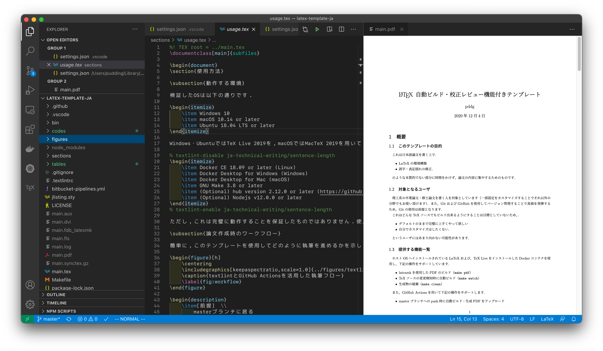

# 日本語論文をLaTeXで書いて、textlintをするためのテンプレート

## 機能

* 個人環境にLaTeX workshopを構築せず、dockerでビルドします
* GitHub Actionsを使用してtextlintを実行します
* github上にreleaseします
* レジュメや論文用のテンプレートを持ちますが、あくまで個人の環境用に構築したものです

## 環境

* Windows 10 or later
* macOS 10.14 or later
* Ubuntu 18.04 LTS or later

Docker環境が必要ですが、clsファイルについては多少弄ればCloud LaTeX等でも使用できます

* Docker Desktop for Mac 2.1 or later
* Docker 18.06 or later
* Docker Desktop for Windows

Ubuntu 20.04 LTS上の TeX Live 2022を使用します  
ビルド用のdocker imageは[こちらのリポジトリ](https://github.com/being24/latex-docker)を参照してください

また、VSCodeが必要です

## 使い方

使い方やFAQはこの[記事](https://zenn.dev/being/articles/how-to-use-my-latex)にまとめています

## License

CC0

## Author

Being

## config

VSCode上での設定例は[settings.json](.vscode/settings.json)を参照してください

## テンプレートについて

できるだけモダナイズを意識して作成したテンプレートですが、LaTeXに詳しいわけではないので誤りがあった場合は教えていただけると幸いです  
実際の使用時はexample等必要のないファイルは消してください

jlistingの代わりにmintedを使用し、参考文献はbiblatexを使用します

### resume.cls

[resume.cls](/resume.cls)は2段組みのレジュメを作成するためのクラスファイルです  
使用方法は[例](/example/resume_template.tex)を参照してください

### report.cls

[report.cls](/report.cls)は論文を作成するためのクラスファイルです  
使用方法は[例](/example/report_template.tex)を参照してください

### .vscode/settings.jsonについて

使用しやすい設定を参考程度ですが上げておきます。  
VSCodeであればこの設定を読み込んでくれるため、設定を変更する必要はありません

## 参考URL

<https://poyo.hatenablog.jp/entry/2020/12/05/110000>
